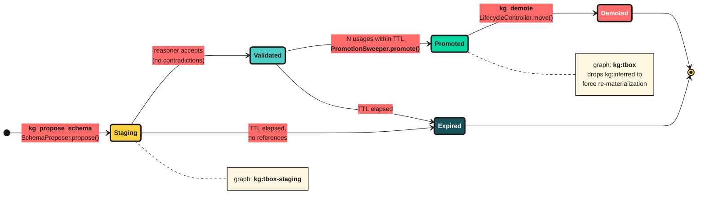

# predicate-agent

The growth and maintenance logic that keeps the graph useful over time: goal
tracking, goal decomposition, gap detection, schema proposals, the use-gated
promotion sweeper, generalization, and turn extraction.

Part of the [Predicate](https://github.com/NordicAgents/predicate#readme)
monorepo. Consumed by `predicate-mcp` (`kg_research_goal`, `kg_maintain`,
`kg_extract_judgments`) and by the CLI's capture/extract path.

## Modules

| Module | Role |
|---|---|
| `goal-store.ts` | Persists research goals and their resolution state in `kg:goals`. |
| `decomposer.ts` / `semantic-decomposer.ts` | Break a goal into sub-questions; report which predicates the live TBox can/cannot answer. |
| `gap-detector.ts` | Find missing schema needed to satisfy a goal. |
| `schema-proposer.ts` | Stage `SchemaDelta` proposals into `kg:tbox-staging`. |
| `promotion-sweeper.ts` | Promote staged deltas only after N successful uses inside a TTL; expire the rest. |
| `generalizer.ts` | Periodically generalize concepts to keep the graph bounded. |
| `turn-extractor.ts` / `semantic-extractor.ts` / `extractor.ts` | Extract typed triples (files modified, commands passed/failed) from a session turn into `kg:abox`. |
| `transcript-adapters.ts` | Normalize Stop-hook payloads from different hosts. |
| `research-goal.ts` / `research-source.ts` | Orchestrate optional research execution against a goal. |
| `completion-provider.ts` | Optional LLM-augmented decomposer fallback (needs `ANTHROPIC_API_KEY`). |

## Schema lifecycle



Source: [`docs/diagrams/schema-lifecycle.mmd`](../../docs/diagrams/schema-lifecycle.mmd).

## Dependencies

`@anthropic-ai/sdk` (optional fallback only), `predicate-mcp`, `predicate-reasoner`.

## Scripts

```bash
pnpm build
pnpm test        # vitest
pnpm typecheck
```
