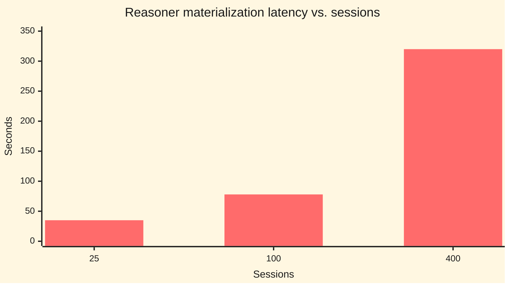

# Scale experiment — the faithful single-user case (how Predicate is actually used)

Predicate is **single-user** agent memory. The realistic axis is not "grow the number
of entities" but **facts accumulating for one developer over time** about a *fixed*
codebase. So we hold the codebase fixed (a 100-file dependency DAG — the signal that
answers "what does X depend on") and grow the **captured history** (per-session
edit/command events — the noise). Generator:
`src/scale/generate-codebase-history.ts`.

Three arms are compared on the same generated history, same questions, same facts:

- **(c) reasoner** — materialize the full closure + golden SPARQL.
- **(a) flat-all** — every fact in the model's context.
- **(b) flat-retrieved** — a dead-simple k-hop `dependsOn` neighbourhood, then the
  model reasons in-context.

## Sweep (`pnpm --filter predicate-eval scale-history`)

| sessions | total facts | reasoner materialize | reasoner acc | flat-all tokens | retrieved facts | flat-retrieved tokens |
|---|---|---|---|---|---|---|
| 25  | 547   | 35 s   | 1.00 | 23 k  | 25 | **1.6 k** |
| 100 | 1,297 | 78 s   | 1.00 | 55 k  | 25 | **1.6 k** |
| 400 | 4,297 | **320 s (5.3 min)** | 1.00 | 182 k | 25 | **1.6 k** |

Flat-retrieved tokens stay constant at 1.6 k across the same sweep (see the
table) — the contrast is the headline result. Diagram source:
[`docs/diagrams/scale-findings.mmd`](../../docs/diagrams/scale-findings.mmd).

Live flat-retrieved accuracy anchor (Haiku, 400 sessions): **mean f1 = 0.98** (3/4
questions perfect, including a 28-file transitive closure; one miss of one element).

## The verdict for the real use case

The answer to every "what does X depend on" question is **identical at 25 and at 400
sessions** — the codebase didn't change, only the captured noise grew. Given that:

- **The reasoner is the WORST-scaling arm.** Its materialization explodes to **5+ minutes
  at ~4 k facts** because it re-processes all the accumulated edit/command noise it doesn't
  even need to answer the question. A "memory that grows with use" that pays minutes per
  refresh is unusable.
- **Flat-all** grows linearly toward the context ceiling (182 k tokens at 400 sessions) —
  it works for a while, then can't fit.
- **Flat-retrieved wins decisively.** A 5-line BFS pulls the dependency neighbourhood
  (~25 facts, **1.6 k tokens, constant forever** regardless of how much history piled up),
  and the model answers it at **0.98 accuracy** — matching the reasoner — instantly, with
  no graph, no SPARQL, no materialization.

**Conclusion for single-user agent memory:** the valuable architecture is **capture + cheap
retrieval of the relevant neighbourhood + the model reasoning in-context.** The OWL/SPARQL/
materialization reasoning layer — the heaviest, slowest part of Predicate — is not just
unneeded here, it actively *hurts*: its cost scales with total captured noise while the
useful answer and the retrieval cost stay constant. The reasoner's only remaining edge is
exactness/determinism/provenance (0.98 vs 1.00, plus an auditable derivation) — a real but
narrow, niche-specific value, not the general capability win the project was premised on.
